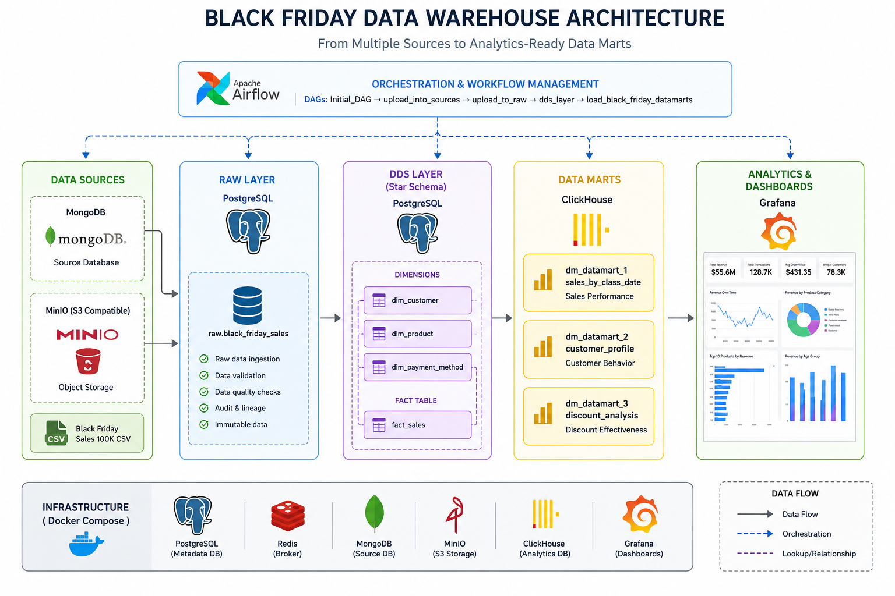
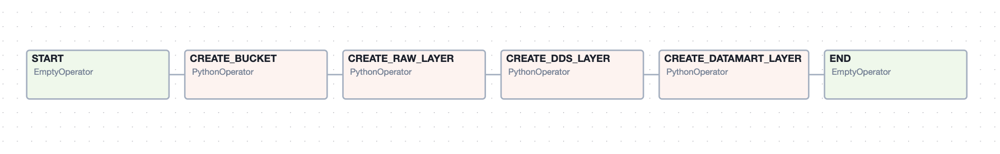
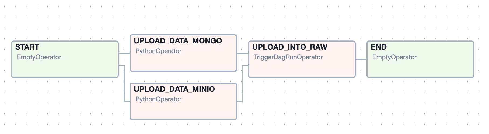
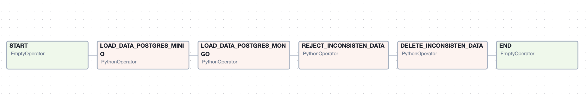
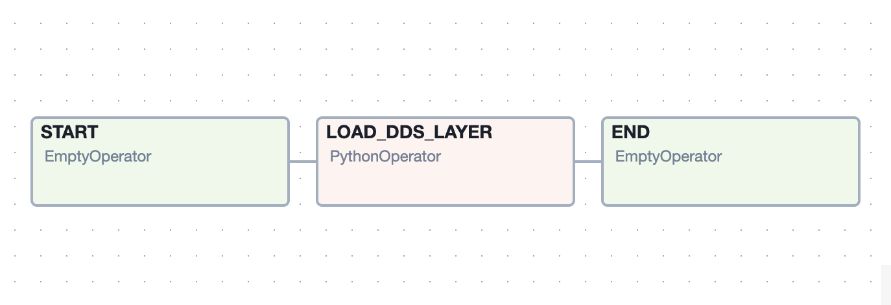
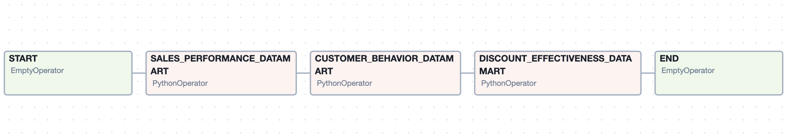

# 🛍️ Black Friday Data Warehouse Project


## 📖 Overview

This project demonstrates the design and implementation of a modern Data Warehouse using a Black Friday retail dataset.

The solution follows a layered architecture and orchestrates the complete data flow using Apache Airflow:

**MongoDB + MinIO → PostgreSQL Raw Layer → PostgreSQL DDS Layer → ClickHouse Data Marts → Grafana Dashboards**

The project simulates a real-world enterprise data platform where data arrives from multiple source systems, is validated and transformed, and is then delivered to analytical data marts.

---

## 🏗️ Architecture

```text
                    Black Friday Dataset
                              │
             ┌────────────────┴────────────────┐
             │                                 │
             ▼                                 ▼
         MongoDB                           MinIO
       (Source DB)                   (Object Storage)
             │                                 │
             └──────────────┬──────────────────┘
                            ▼
                  PostgreSQL RAW Layer
                            │
                            ▼
                    Data Validation
                            │
                            ▼
                 PostgreSQL DDS Layer
                    (Star Schema)
                            │
                            ▼
                   ClickHouse Datamarts
                            │
                            ▼
                     Grafana Dashboards
```

<p align="center">
  
</p>

---

## 🚀 Pipeline Workflow

### 1. Infrastructure Initialization

Creates:

* MinIO buckets
* Raw schema
* DDS schema
* Datamart structures

Airflow DAG:

```text
Initial_DAG
```

---

### 2. Source Data Loading

Uploads source data into:

* MongoDB
* MinIO

Airflow DAG:

```text
upload_into_sources
```

---

### 3. Raw Layer Loading

Loads source data into PostgreSQL Raw Layer.

Responsibilities:

* Data ingestion
* Validation
* Schema enforcement
* Data quality checks

---

### 4. DDS Layer Processing

Builds a dimensional model consisting of:

#### Dimensions

* dim_customer
* dim_product
* dim_payment_method

#### Fact Table

* fact_sales

Business-ready warehouse structures are created from validated raw data.

---

### 5. Analytical Datamarts

ClickHouse datamarts are generated for reporting and dashboarding.

#### Sales Performance Datamart

Tracks:

* Revenue
* Transactions
* Product category performance
* Customer activity

#### Customer Behavior Datamart

Tracks:

* Favorite categories
* Spending patterns
* Preferred shopping days

#### Discount Effectiveness Datamart

Tracks:

* Discount impact
* Sales uplift
* Purchase behavior

---

## 📂 Project Structure

```text
black_friday_sales_analysis
│
├── dags/
│   ├── initial_dag.py
│   ├── upload_into_source_dag.py
│   ├── upload_to_raw_layer.py
│   └── dds_layer_dag.py
│
├── scripts/
│   ├── initial/
│   ├── upload_data/
│   ├── raw_layer/
│   ├── dds_layer/
│   └── core_layer/
│
├── original_source/
├── source_s3/
├── source_mongo/
│
├── docker-compose.yml
└── README.md
```

---

## 🗄️ Data Warehouse Model

### RAW Layer

Purpose:

* Preserve source data
* Enable auditability
* Support reprocessing

### DDS Layer

Star-schema implementation:

#### Dimensions

| Table              | Purpose             |
| ------------------ | ------------------- |
| dim_customer       | Customer attributes |
| dim_product        | Product attributes  |
| dim_payment_method | Payment information |

#### Facts

| Table      | Purpose                       |
| ---------- | ----------------------------- |
| fact_sales | Transaction-level sales facts |

### Datamarts

| Datamart                          | Description            |
| --------------------------------- | ---------------------- |
| dm_datamart_1_sales_by_class_date | Sales performance      |
| dm_datamart_2_customer_profile    | Customer analytics     |
| dm_datamart_3_discount_analysis   | Discount effectiveness |

---

## 🛠️ Technology Stack

### Orchestration

* Apache Airflow

### Storage

* MinIO (S3-compatible)

### Source Systems

* MongoDB

### Data Warehouse

* PostgreSQL

### Analytics

* ClickHouse

### Visualization

* Grafana

### Processing

* Python
* Pandas

### Infrastructure

* Docker
* Docker Compose

---

## ▶️ Running the Project

### Clone Repository

```bash
git clone https://github.com/YauheniWind/black_friday_sales_analysis.git
cd black_friday_sales_analysis
```

### Create .env file with varibles
```bash
  POSTGRES_USER:              str
  POSTGRES_PASSWORD:          str
  POSTGRES_DB:                str
  MONGO_INITDB_ROOT_USERNAME: str
  MONGO_INITDB_ROOT_PASSWORD: str
  MONGO_INITDB_DATABASE:      str
  MINIO_ROOT_USER:            str
  MINIO_ROOT_PASSWORD:        str
  CLICKHOUSE_USER:            str
  CLICKHOUSE_PASSWORD:        str
  CLICKHOUSE_DB:              str
  GF_SECURITY_ADMIN_US:       str
  GF_SECURITY_ADMIN_PASSWO:   str
  POSTGRES_USER:              str
  POSTGRES_PASSWORD:          str
  POSTGRES_DB:                str
```

### Start Infrastructure

```bash
docker-composer --env-file .env up -d
```

### Open Services

| Service    | URL                   |
| ---------- | --------------------- |
| Airflow    | http://localhost:8080 |
| MinIO      | http://localhost:9002 |
| Grafana    | http://localhost:3000 |
| ClickHouse | http://localhost:8123 |

---

## 📊 Dashboards

ToDo add screenshots here:

```markdown

```

```markdown
<p align="center">
  
</p>

<p align="center">
  
</p>

<p align="center">
  
</p>

<p align="center">
  
</p>

<p align="center">
  
</p>
```

---

## 🎯 Business Questions Answered

### Customer Analytics

* Which customer segments generate the highest revenue?
* Which age groups spend the most?
* What are the most popular product categories?

### Sales Analytics

* Revenue by product category
* Revenue trends by date
* Average order value

### Discount Analytics

* Do discounts increase transaction volume?
* How effective are promotional campaigns?
* What is the revenue impact of discounts?

---

## 🔮 Future Improvements

* Data quality monitoring
* Great Expectations integration
* dbt transformations
* CI/CD pipelines
* Kubernetes deployment
* Real-time ingestion with Kafka

---

## 👨‍💻 Author

**Yauheni Hraudzin**

GitHub: https://github.com/YauheniWind

---

## 📄 License

Educational and portfolio project.
